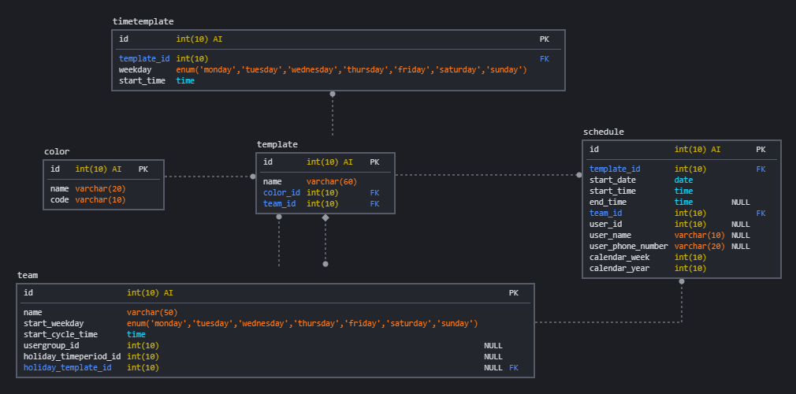

# On duty manager for director 1.8

This module is a visualization of an on-duty-manager to dynamically change the contacts which should be notified. It shows you in tabular form a calendar week of a year with its days and the icinga-contact which is on duty at every time of the week.
It contains functionality to create a new empty on-duty-week by templates. This way you don't have to set every duty individually. Afterwards you can set all the contacts for this specific week which are on duty.
It is also possible to insert a new user in a day if there is a unforeseen difficulty, to take the duty from another contact.

Note: this is only the web interface for establishing the schedule. For sending out any real notifications you need to establish a script for sending out the real notification. This could be any form of notification channel you implement (teams, sms, email etc.).

## DB SCHEMA
* 

## Motivation
The goal of this module is to create a visualization for the user to understand which contact should be contacted with a sms if a notification goes out. This way you can divide the duty between different user instead of contacting always the same user.

## Documentation 
* [Installation](doc/01-Installation.md)

## Author

* **Dominik Gramegna** - *Initial work*

## License

* See the [LICENSE](LICENSE) for details
